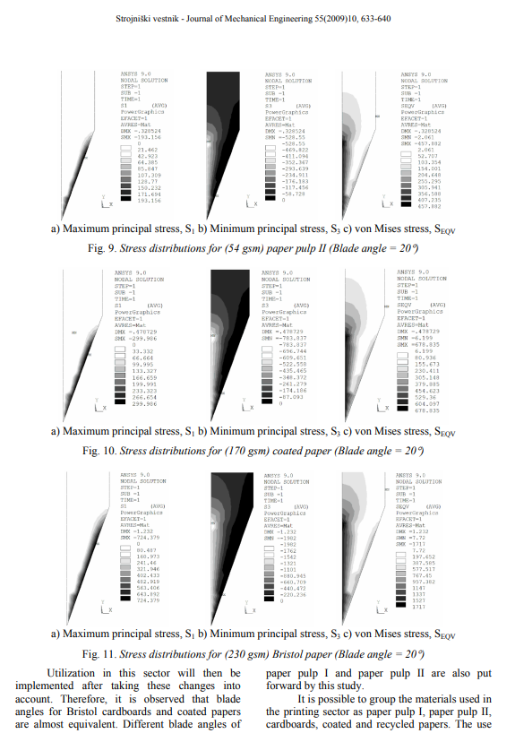

# Makale 6: Endüstriyel Makaslamada Rake Açısının (Makas Bıçağı Bevel Açısı) Kritik Rolü

**Kaynak:** https://maxtormetal.com/shear-blade-bevel-angle-industrial-shearing-cut-quality/  
**Yayıncı:** Nanjing Metal Industrial CO., Limited (MaxtorMetal)  
**Yazar:** Tommy  
**Son Güncelleme:** 9 Aralık 2025  

---

## İçindekiler
1. Temel Çıkarımlar (Key Takeaways)
2. Rake Açısı ve Makas Bıçağı Bevel Açısını Anlama
3. Rake Açısının Kesim Kalitesi ve Verimliliğe Etkisi
4. Makas Açısı Dengeleri: Kuvvet vs. Malzeme Bükülmesi
5. Optimum Rake Açısı Seçimi
6. En İyi Uygulamalar: Rake Açısı ve Bıçak Bakımı
7. Yaygın Rake Açısı Hataları ve Çözümleri
8. SSS (FAQ)

---

## 1. Temel Çıkarımlar (Key Takeaways)

- Rake açısı makinenin ne kadar iyi kestiğini değiştirir. **Pozitif rake açısı** kesimi kolaylaştırır ve daha pürüzsüz hale getirir.
- Doğru rake açısı seçimi çok önemli. **Yumuşak metaller pozitif rake açısı**, **sert metaller daha az keskin açı** gerektirir.
- Yüksek rake açısı daha temiz kesim yapar ama malzemeyi bükebilir veya bürtebilir. **Doğru dengeyi bulmak** gerekir.
- Bıçak bakımı ömrü uzatır: temizle, bilele ve açıları sık kontrol et.
- Rake açısı ve makas bıçağı bevel açısının birlikte çalışmasını anlamak daha iyi kesim ve çapak önleme sağlar.
- Farklı malzeme kalınlıkları için rake açısını ayarla. **Kalın malzemeler genellikle daha düşük rake açısı** gerektirir.
- Kesime başlamadan önce daima rake açısını ölç ve ayarla.
- Eğitim ve düzenli bakım, rake açısı hatalarını önler.

---

## 2. Rake Açısı ve Makas Bıçağı Bevel Açısını Anlama

### 2.1 Rake Açısı Tanımı (Shearing'de)

Rake açısı, **kesici aletin yüzeyi ile kesmek istediğiniz malzemenin yüzeyi arasındaki açıdır**. Bu açı, aletin malzemeyle nasıl buluştuğunu kontrol eder.

- **Pozitif rake açısı** seçildiğinde: Bıçağın kesmesi kolaylaşır, talaşlar kesim alanından uzaklaşır, daha az güç kullanılır, daha pürüzsüz kesim elde edilir.
- **Negatif rake açısı** seçildiğinde: Bıçak kenarı güçlenir, sert veya kırılgan malzemeleri kesmede yardımcı olur.
- Rake açısı, **makaslama düzleminin (shear plane)** nasıl oluştuğunu değiştirir. Makaslama düzlemi, malzemenin kesim sırasında kırılıp ayrıldığı yerdir.

### 2.2 Makas Bıçağı Bevel Açısı Geometrisi

Makas bıçağı bevel açısı, **bıçak kenarının şeklidir** (yandan bakıldığında görülen açı). Bevel açısı, rake açısı ile birlikte çalışarak bıçağın malzemeye nasıl girdiğini kontrol eder.

- Doğru ayarlandığında: Temiz kesen keskin kenar oluşur
- Kesme kuvvetini odaklamaya yardımcı olur
- Her iki açı doğru ayarlandığında bıçak ömrü uzar ve kesim kalitesi artar

### 2.3 Makas Açısı ve Kesim Mekaniği

Makas açısı (shear angle), malzemenin kesilirken nasıl kaydığını ve kırıldığını tanımlar. Rake açısı ile birlikte çalışır:

- **Yüksek rake açısı** → Kesim için gereken kuvveti düşürür, ancak makas açısını değiştirir ve malzeme bükülmesine/eğilmesine neden olabilir
- **Düşük rake açısı** → Daha fazla kuvvet gerektirir, kesim daha az pürüzsüz olur, daha fazla enerji harcar

### 2.4 Kuvvet Yönü ve Talaş Akışı

| Özellik | Açıklama |
|---------|----------|
| Yüksek rake açısı | Talaşların dışarı akmasını sağlar, kesim temizlenir. Ancak malzemeyi bürtebilir. |
| Düşük rake açısı | Talaşlar iyi hareket etmeyebilir, daha fazla atık ve pürüzlü kenarlar oluşabilir |
| Makas açısı | Rake açısıyla birlikte değişir, malzemenin nasıl kırıldığını etkiler |

> **İpucu:** Kesime başlamadan önce daima rake açısı, makas açısı ve bevel açısını kontrol et.

---

## 3. Rake Açısının Kesim Kalitesi ve Verimliliğe Etkisi

### 3.1 Kesim Kalitesi ve Çapak Oluşumu

Doğru rake açısı ayarlandığında **daha az çapak (burr)** ve daha pürüzsüz kenar elde edilir. Çapaklar, kesimden sonra dışarı çıkan küçük metal parçacıklarıdır.

**Kesim kalitesini etkileyen faktörler tablosu:**

| Faktör | Açıklama |
|--------|----------|
| Bıçak Boşluğu (Blade Clearance) | Üst ve alt bıçaklar arasındaki mesafe; çapakları önler ve kenarın bükülmesini engeller |
| Rake Açısı | Kesim kuvvetini ve malzemenin hareketini değiştirir; en iyi açılar malzeme kalınlığına bağlıdır |
| Hold-Down Basıncı | Malzemeyi kesim sırasında sabit tutar; iz veya hareket önlemek için doğru ayarlanmalıdır |
| Backstop Konumlandırma | Kesimlerin doğru olmasını sağlar; yanlış ayar boyut hatası yapar |
| Malzeme Kalınlığı | Kalın parçalar bıçak boşluğunda ve kesim kuvvetinde değişiklik gerektirir |
| Malzeme Sertliği | Sert metaller daha temiz keser ama daha fazla kuvvet gerektirir ve bıçağı daha hızlı aşındırır |
| Malzeme Bileşimi | Paslanmaz çelik, alüminyum vb. farklı ayarlar gerektirir |
| Bıçak Durumu | Keskin, hizalanmış bıçaklar temiz kesim için gereklidir; körelmiş veya eğri bıçaklar daha fazla çapak yapar |
| Bakım Uygulamaları | Düzenli bıçak bakımı iyi çalışmayı ve temiz kesim kalitesini korur |

**Rake açısı ve ilerleme hızının çapak boyutuna etkisi:**

| Rake Açısı | İlerleme Hızı | Çapak Yüksekliği Değişimi |
|-----------|---------------|--------------------------|
| Düşük | Yüksek | Artar |
| Yüksek | Düşük | Azalır |

> Büyük rake açısı + düşük ilerleme hızı = daha temiz kenar ve daha hassas boyut kontrolü.

### 3.2 Kenar Bitişi ve Boyutsal Doğruluk

- Pozitif rake açısı → Daha keskin kenar, daha iyi boyut kontrolü
- Pürüzlü noktalar azaltılır, boyut doğru tutulur
- Makas açısı kesim kuvvetini yönlendirir → Metalin bükülmesini/gerilmesini engeller

### 3.3 Makaslama Kuvveti ve Enerji Kullanımı

**Enerji tüketimi tablosu:**

| Parametre | Enerji Tüketimine Etkisi |
|-----------|-------------------------|
| Pozitif Rake Açısı | Daha az güç kullanır |
| Negatif Rake Açısı | Daha fazla güç kullanır |
| Kesim Kuvveti | Metalin kesilmesi için gereken kuvveti değiştirir |
| Takım Aşınması ve Ömür | Takımın ne kadar dayanacağını ve ne kadar iyi çalışacağını değiştirir |
| Talaş Oluşumu | Talaşların görünümünü ve takım ömrünü değiştirir |
| Yüzey Bitişi | Kesimin ne kadar pürüzsüz göründüğünü değiştirir |

**Önemli:** Makasların çoğu 2°'ye kadar rake açısı kullanır. 5°'den büyük açılar daha fazla bükülmeye neden olabilir.

### 3.4 Mekanik Kuvvet Analizi

Açılı araçlar kullanıldığında bıçak metalin bir noktasında kesmeye başlar ve kenar boyunca ilerler → Kesim kolaylaşır, daha az kuvvet gerekir.

### 3.5 Bıçak Aşınması ve Bakımı

**6 adımlı bıçak bakım prosedürü:**

1. Bıçakları sık sık izopropil alkol ve bez ile temizle
2. Bıçaklara yağ uygula
3. Bıçakları sık sık bilele ve taşla
4. Bıçak boşluğunu ve hizasını kontrol et ve düzelt
5. Eski parçaları gerektiğinde değiştir
6. Bıçakları dikkatli taşı, hasar verme

### 3.6 Bıçak Ömrü ve Yeniden Bileme

Bıçağın aşındığının belirtileri:
- Pürüzlü kenarlar veya daha fazla çapak
- Bıçak kör hissediyor veya malzemedan sürükleniyor
- Bıçak kenarında çip veya çatlak
- Aynı malzemeyi kesmek için daha fazla kuvvet gerekiyor

---

## 4. Makas Açısı Dengeleri: Kuvvet vs. Malzeme Bükülmesi

### 4.1 Düşük Rake Açısı Etkileri

#### 4.1.1 Azaltılmış Makaslama Kuvveti Gereksinimi
- Bıçak kenarı düz duruma yakın
- Makası başlatmak için **daha az kuvvet gerekir**
- Daha hızlı çalışma → İnce levhalar ve yumuşak metaller için ideal
- Yüksek hızlarda çalışılabilir

#### 4.1.2 Artırılmış Malzeme Bozulması ve Deformasyon
- Kesim kuvveti doğrudan metale iner → Parça **bükülür, eğilir, kıvrılır**
- **Twist (Burulma):** Kesilen parça spiral/tirbuşon şeklini alabilir (özellikle ince kesitlerde)
- **Bowing (Eğilme):** Malzeme makaslama sırasında aşağı doğru bükülür (uzun, ince şeritlerde en belirgin)
- Daha fazla çapak ve pürüzlü kenarlar

#### 4.1.3 Tipik Uygulamalar ve Sınırlamalar
- **Uygun:** İnce levhalar, yumuşak metaller, hızlı çalışma → Alüminyum, bakır, ince çelik levhalar
- **Sınırlama:** Kalın veya sert metallerde bıçak hasarı veya kötü sonuç, parçalarda daha fazla bozulma

### 4.2 Yüksek Rake Açısı Etkileri

#### 4.2.1 Daha Yüksek Makaslama Kuvveti Talebi
- Bıçak kenarı daha öne eğik
- Malzemeyi kesmek için **daha fazla kuvvet gerekir**
- Kesim daha uzun alanda yayılır → Makine daha çok çalışır
- Temiz kesim veya kalın/sert metallerle çalışırken yaygın

**Önemli:**
- Yüksek pozitif rake açısı bazı malzemelerde kesim kuvvetini düşürür → Daha verimli
- Negatif rake açısı kuvveti artırır ama sert/kırılgan metaller için bıçağa güç verir

#### 4.2.2 İyileştirilmiş Kenar Kalitesi ve Boyutsal Hassasiyet
- **Daha az çapak**, daha keskin kenar
- Boyut ve şekil planlarına daha uygun parçalar
- Pozitif rake → Kenar daha keskin, talaşlar uzaklaşır, kuvvet azalır
- Negatif rake → Kenar güçlenir ama daha pürüzlü bitiş

#### 4.2.3 Azaltılmış Malzeme Bozulması
- Kesim kuvveti yayılır → Metal düz kalır, bükülme/eğilme azalır
- İnce parçalarda yine de bükülme olabilir

#### 4.2.4 Uygulama Senaryoları
- **Uygun:** Kalın plakalar, sert metaller, bozulma istenmediğinde → Paslanmaz çelik, takım çeliği, makine parçaları
- **Dikkat:** Fazladan kuvvet ve zaman, her iş için ayar gerekebilir

### 4.3 Düşük vs. Yüksek Rake Açısı Karşılaştırma Tablosu

| Rake Açısı Türü | Makaslama Kuvveti | Kenar Kalitesi | Malzeme Bozulması | En Uygun | Zorluklar |
|-----------------|-------------------|----------------|-------------------|----------|-----------|
| **Düşük** | Daha düşük | Daha pürüzlü | Daha fazla bükülme/bürtme | İnce, yumuşak metaller | Daha fazla çapak, daha az hassasiyet |
| **Yüksek** | Daha yüksek | Daha pürüzsüz | Daha az bükülme/bürtme | Kalın, sert metaller | Daha fazla kuvvet, daha yavaş kurulum |

---

## 5. Optimum Rake Açısı Seçimi

### 5.1 Malzeme Türü ve Kalınlık

#### 5.1.1 Yüksek-Gerilimli vs. Yumuşak Metaller

| Rake Açısı Türü | Malzeme Türü | İşleme Üzerindeki Etkiler |
|-----------------|-------------|--------------------------|
| **Pozitif Rake Açısı** | Yumuşak malzemeler (ör. alüminyum) | Kesim kuvvetlerini azaltır, yüzey bitişini iyileştirir |
| **Negatif Rake Açısı** | Sert metaller (ör. paslanmaz çelik) | Takım gücünü artırır, ağır hizmet operasyonları için daha iyi |
| **Sıfır Rake Açısı** | Çok sert malzemeler | Karbür araçlarda kullanılır, takım rijitliğini korur |

#### 5.1.2 Kalınlık için Rake Açısı Önerileri

| Malzeme Kalınlığı (mm) | Önerilen Rake Açısı (derece) |
|------------------------|------------------------------|
| 2 mm'ye kadar | 1.5°'den biraz düşük |
| 0.5 mm | 2° - 10° |
| Sertleştirilmemiş malzemeler | 0° |

**Kural:**
- **İnce levhalar** → Daha yüksek rake açısı → Pürüzsüz kenar, doğru boyut
- **Kalın plakalar** → Daha düşük rake açısı → Bıçak güvenliği, sabit kesim

> **İpucu:** Rake açısını ayarlamadan önce daima malzeme kalınlığını ölç.

### 5.2 Uygulama Hedefleri ve Kesim Kalitesi

#### 5.2.1 Hassasiyet vs. Üretim Hızı

- **Pozitif rake açısı** → Yumuşak metaller ve hassas işler için → Pürüzsüz kesim ve doğru boyut
- **Negatif rake açısı** → Sert metaller ve zorlu işler için → Güçlü takım, daha uzun ömür
- Daha hızlı kesim = metale daha fazla baskı

#### 5.2.2 Kesim Kalitesi ve Üretim Hızı Dengesi

- **Yüksek rake açısı** → Mükemmel kenarlar ve tam boyutlar gerektiren işler
- **Düşük rake açısı** → Hızlı çalışma, ince veya yumuşak metal kesimleri
- Her zaman metal türü ve kalınlığı kontrol et
- Makas açısını işe göre ayarla

---

## 6. En İyi Uygulamalar: Rake Açısı ve Bıçak Bakımı

### 6.1 Rake Açısı Ayarlama ve Kalibrasyon

#### 6.1.1 Kalibrasyon ve Ölçüm
- Herhangi bir makaslama işleminden önce rake açısını kontrol et
- **İletki veya dijital açıölçer** kullanarak rake açısını ölç
- Aleti bıçak yüzeyine yerleştir ve malzeme yüzeyiyle karşılaştır
- Bıçak boyunca **birkaç noktadan** ölç (açının baştan sona aynı kalmasını sağla)
- Farklılık varsa ayarla

#### 6.1.2 Açı Ayarlama Araçları
- İletki ve dijital açıölçerler → Rake açısı ölçümü
- Anahtar ve tork araçları → Bıçak bağlantılarını gevşetme/sıkma
- Feeler gaugelar → Bıçak boşluğu kontrolü
- Ayar vidaları veya hidrolik sistemler → İnce ayar

#### 6.1.3 Adım Adım Açı Ayarlama Prosedürü (8 Adım)

1. Makası kapat ve güvenlik için kilitle
2. Bıçağı ve montaj alanını temizle
3. İletki veya dijital gaugeyle mevcut rake açısını ölç
4. Uygun aletle bıçak bağlantılarını gevşet
5. Makasın ayar vidaları veya hidrolik sistemiyle bıçağı ayarla
6. Ayarlamayı kontrol etmek için rake açısını tekrar ölç
7. Bağlantıları sık ve açıyı bir kez daha kontrol et
8. Kesimin iyi görünmesini sağlamak için numune parçada test yap

> **İpucu:** Final rake açısını daima bakım günlüğüne kaydet. Bu, değişiklikleri izlemeye ve sorunları erken tespit etmeye yardımcı olur.

#### 6.1.4 Yaygın Kalibrasyon Hataları ve Çözümleri

| Hata | Sonucu |
|------|--------|
| Bıçağın sadece bir noktasından ölçmek | Düzensiz açıların gözden kaçması |
| Aşınmış veya kirli araçlar kullanmak | Yanlış okuma |
| Ayar sonrası bıçak bağlantılarını kilitlemeyi unutmak | Kayma/hizasızlık |
| Büyük işten önce deneme kesimi atlama | Kötü sonuç keşfetilmez |

### 6.2 Makas Bıçağı Bevel Açısı Bakımı

#### 6.2.1 Yeniden Bileme ve Kalite Kontrol
Yeniden bileme sırasında yapılması gerekenler:
1. Bıçak kenarının montaj tabanına paralel kalmasını sağla
2. Her seferinde doğru bevel açısını geri yükle
3. Bıçak sertliğini ve ömrünü korumak için taşlama ısısını kontrol et

**Yeniden bileme işaretleri:**
- Kesimlerde daha fazla çapak veya pürüzlü kenar
- Bıçak kör hissedilir veya malzemede sürüklenir
- Bıçak kenarında çip veya çatlak
- Aynı malzemeyi kesmek için daha fazla kuvvet gerekir

#### 6.2.2 Bevel Açısı Tutarlılığı için Kalite Kontrol Prosedürleri
- Her bileme sonrası bevel açısını kontrol et
- Bevel gauge veya açı iletkisiyle bıçak boyunca ölç
- Okumaları orijinal spesifikasyonlarla karşılaştır
- Fark varsa taşlama sürecini ayarla
- Her ölçümü bakım günlüğüne kaydet

#### 6.2.3 Bakım Çizelgesi

| Görev | Sıklık | Notlar |
|-------|--------|--------|
| Rake açısı kontrolü | Haftalık | Birkaç noktadan ölç |
| Bıçak temizliği | Her vardiya sonrası | Kalıntıları temizle ve yağla |
| Bevel açısı kontrolü | Her bileme sonrası | Bevel gauge kullan |
| Bıçak bileme | Gerektiğinde | Aşınma belirtilerini izle |
| Günlük kaydı güncelleme | Her görevde | Tüm ölçümleri kaydet |

---

## 7. Yaygın Rake Açısı Hataları ve Çözümleri

### 7.1 Sık Görülen Operasyon Hataları

| Kusur | Açıklama | Neden | Çözüm |
|-------|----------|-------|-------|
| **Twisting (Bükülme)** | Metal kesim sonrası bükülür veya kıvrılır | Aşırı rake açısı | Levha şekline, metal türüne ve kesim yöntemine göre rake açısını değiştir |
| **Twist (Spiral)** | Kesilen parça spiral/tirbuşon şekli alır | Aşırı rake açısı | Metal ve kalınlık için gereken minimuma düşür |
| **Hatalı Açı** | Metal türüne uyumsuz açı | Yanlış malzeme-açı eşleşmesi | Metal türü ve kalınlığını kontrol et, her iş için doğru açıyı kullan |

### 7.2 Önleyici Tedbirler

**4 adımlı hata önleme:**

1. **Doğru Araç Seçimi:** Kesmek istenen metalle eşleşen rake açılı bıçak ve araçlar seç
2. **Makine Ayarlarını İnce Ayarla:** Bıçak boşluğu, makas açısı ve kesim hızını metale göre ayarla
3. **İleri Ekipmana Yatırım Yap:** Rake açısını kolayca ayarlayıp kontrol edebilen iyi makineler kullan
4. **Düzenli Bakım ve Kalibrasyon:** Planlı bakım ve kontroller yap, bıçakları temizle, rake açısını kontrol et, ayarları kaydet

### 7.3 Pozitif vs. Negatif Rake Açısı Karşılaştırma

| Faktör | Pozitif Rake Açısı | Negatif Rake Açısı |
|--------|-------------------|--------------------|
| **Talaş Oluşumu** | Daha kolay, sürekli | Parçalı, daha pürüzlü |
| **Kesim Kuvvetleri** | Daha düşük | Daha yüksek |
| **Yüzey Bitişi** | Daha pürüzsüz | Daha pürüzlü |

---

## 8. SSS (FAQ)

**S: Endüstriyel makaslama'da rake açısı nedir?**
C: Makas bıçağınızın yüzeyi ile kesmek istediğiniz malzeme arasındaki açıdır. Bıçağın metalden nasıl geçtiğini kontrol eder.

**S: Rake açısı kesim kalitesi için neden önemli?**
C: Doğru ayarlandığında daha pürüzsüz kenarlar ve daha az çapak elde edilir. İyi rake açısı bıçağın malzemeden kolayca geçmesini sağlar.

**S: Farklı malzemeler için en iyi rake açısını nasıl seçersiniz?**
C: Yumuşak/ince metaller için daha yüksek, sert/kalın metaller için daha düşük rake açısı. Daima ayar öncesi malzeme türü ve kalınlığını kontrol et.

**S: Yanlış rake açısı kullanırsanız ne olur?**
C: Pürüzlü kenarlar, daha fazla çapak, bükülmüş parçalar. Bıçak da daha hızlı aşınır.

**S: Rake açısını ne sıklıkla kontrol etmeli?**
C: Her yeni iş öncesi. Malzeme veya kalınlık değişirse ölç ve ayarla.

**S: Tüm makaslama makinelerinde rake açısı ayarlanabilir mi?**
C: Modern makinelerin çoğunda evet. Eski makinelerde bu özellik olmayabilir. Makine kılavuzuna bakın.

**S: Rake açısı ile makas bıçağı bevel açısı arasındaki fark nedir?**
C: Rake açısı bıçağın malzemeyle nasıl buluştuğunu kontrol eder. Bevel açısı bıçak kenarının şeklidir. Her ikisi birlikte en iyi kesimi sağlar.

---

## Diğer Makalelerle Bağlantılar

- **Makale 01** (Bıçak Geometrisi): Rake açısı, bıçak geometrisinin temel parametrelerinden biridir → [01-blade-geometry-cutting-efficiency.md]
- **Makale 02** (Bevel Türleri): Single/double/triple bevel sınıflandırması bevel açısı geometrisi ile doğrudan ilişkili → [02-single-double-triple-bevel-blades.md]
- **Makale 03** (Bevel Açısı): Malzemeye özgü bevel açısı önerileri, buradaki rake açısı önerileriyle birlikte değerlendirilmeli → [03-bevel-angle-efficiency-accuracy.md]
- **Makale 04** (Keskinlik Bilimi): Kenar tipleri ve taşlama yöntemleri bevel açısı bakımı ile bağlantılı → [04-science-of-sharpness-angles-edges.md]
- **Makale 05** (Düz Bıçak Seçimi): Bıçak-makine uyumluluğu ve kaplama bilgileri bu makaledeki bakım ve malzeme seçimi ile tamamlayıcı → [05-straight-blade-selection-precision-cutting.md]

---

## Kritik Öğrenimler (Bu Makaleye Özgü)

1. **Rake açısı ≠ Bevel açısı:** İkisi farklı ama birlikte çalışır
2. **Pozitif/Negatif/Sıfır** rake açıları sınıflandırması yeni bir bilgi (önceki makalelerde yoktu)
3. **Kalınlık-açı ilişkisi** burada detaylı: 2mm'ye kadar ≈1.5°, ince levhalar 2°-10°
4. **Çoğu endüstriyel makas 2°'ye kadar** rake açısı kullanır; 5°'den fazlası bükülmeye neden olur
5. **8 adımlı açı ayarlama prosedürü** pratik uygulanabilir bilgi
6. **Bakım çizelgesi:** Haftalık açı kontrolü, her vardiya temizlik, bileme sonrası bevel kontrolü
7. **Düşük vs. yüksek rake açısı trade-off tablosu** karar verme için çok değerli
